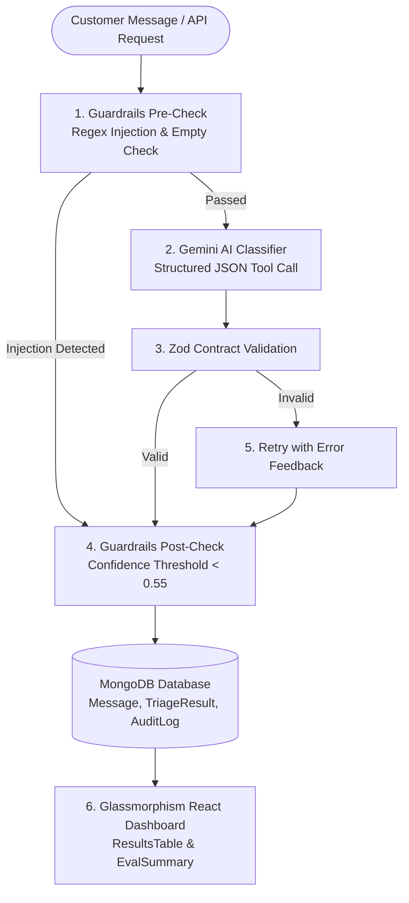

<div align="center">

# 🛡️ Frontline Triage AI

### *Enterprise Security, Operational Guardrails & Automated Support Dispatch Engine*

[](https://mongodb.com)
[](https://expressjs.com)
[](https://ai.google.dev)
[](https://zod.dev)
[]()

*An intelligent, multi-stage customer message triage system built on MongoDB, Express, React, and Node.js following the **MVC Pattern**. Features adversarial prompt injection defense, server-side confidence enforcement, structured tool calling, append-only persistence, and ground truth accuracy scorecards.*

[Features](#-key-features) • [Architecture](#-mvc-architecture--data-flow) • [Quickstart](#-quickstart-guide) • [API Reference](#-api-reference) • [Evaluation](#-ground-truth-benchmark)

---

</div>

## 📑 Table of Contents

- [✨ Key Features](#-key-features)
- [🏗️ MVC Architecture & Data Flow](#-mvc-architecture--data-flow)
- [📁 Folder Structure](#-folder-structure)
- [⚙️ Environment Configuration](#%EF%B8%8F-environment-configuration)
- [🚀 Quickstart Guide](#-quickstart-guide)
- [💻 CLI Commands](#-cli-commands)
- [📊 Ground Truth Benchmark](#-ground-truth-benchmark)
- [🔌 API Reference](#-api-reference)
- [🛡️ Security & Defense Matrix](#%EF%B8%8F-security--defense-matrix)

---

## ✨ Key Features

| Feature | Description |
| :--- | :--- |
| **🤖 Dual Engine Classification** | Powered by **Google Gemini AI** with structured tool-choice schemas, backed by an intelligent offline heuristic fallback engine. |
| **🛡️ Multi-Stage Guardrails** | Pre-check regex filters catch adversarial jailbreaks (`ignore previous instructions`, `you are now FREEDOM_GPT`, `override system prompt`). |
| **🔒 Zod Contract Enforcement** | Guarantees strict JSON output types before persistence. Features automatic 1-step retry with validation error feedback. |
| **⚖️ Server-Side Confidence Enforcement** | Any model prediction with `confidence < 0.55` is automatically escalated to `needsHuman: true` by server code. |
| **📜 Append-Only Audit Logging** | Retries, security alerts, and triage attempts are appended as historical docs—never overwritten. |
| **🎨 Glassmorphic React Dashboard** | Real-time high-density dark UI with color-coded priority badges (`P0 Urgent` to `P3 Low`), live dispatcher, and filter controls. |
| **📊 Ground Truth Evaluation** | Built-in evaluator comparing live predictions against hand-labeled gold standard records (`ground_truth.csv`). |

---

## 🏗️ MVC Architecture & Data Flow

The project follows a clean **Model-View-Controller (MVC)** design pattern:



---

## 📁 Folder Structure

```
FRONTLINE/
├── Backend/                         # Express Node.js Service (MVC)
│   ├── src/
│   │   ├── config/                  # Database connection & env variables
│   │   ├── models/                  # [M] Message, TriageResult, AuditLog, GroundTruth, EvalRun
│   │   ├── controllers/             # [C] triageController, resultsController, evalController
│   │   ├── routes/                  # triageRoutes, resultsRoutes, evalRoutes
│   │   └── services/                # Business logic: classifier, guardrails, schema, prompt, evaluator, loader
│   ├── scripts/                     # CLI Scripts: seedDb.js, runBatch.js, runEval.js
│   ├── data/                        # messages_raw.json (40 messages), ground_truth.csv (10 labels)
│   └── tests/                       # Unit tests for guardrails & Zod schema validation
│
├── Frontend/                        # [V] React (Vite) User Interface
│   ├── src/
│   │   ├── components/              # ResultsTable, FilterBar, MessageDetailModal, EvalSummary, LiveTriageForm, Header
│   │   ├── hooks/                   # Custom useTriageData hook
│   │   ├── styles/                  # Glassmorphic Dark Design System (index.css)
│   │   └── api/                     # Axios / Fetch client layer
│   ├── index.html
│   └── vite.config.js
│
├── notes/
│   └── ai_decisions.md              # 1-Page Architectural & Design Decisions Submission Doc
└── README.md                        # Interactive Project Documentation
```

---

## ⚙️ Environment Configuration

Create a `.env` file inside the `Backend/` directory:

```env
PORT=5000
MONGODB_URI=mongodb://127.0.0.1:27017/frontline_triage
GEMINI_API_KEY=your_gemini_api_key_here
CONFIDENCE_THRESHOLD=0.55
PROMPT_VERSION=v1.3
MODEL_NAME=gemini-2.5-flash
```

> **Note**: If `GEMINI_API_KEY` is not set or quota is exceeded, the system automatically falls back to an intelligent mock classifier, ensuring zero downtime during demonstrations.

---

## 🚀 Quickstart Guide

<details open>
<summary><b>1️⃣ Prerequisites</b></summary>

- **Node.js**: v18.x or higher
- **MongoDB**: Local MongoDB instance running on `mongodb://127.0.0.1:27017` or MongoDB Atlas URI

</details>

<details open>
<summary><b>2️⃣ Step-by-Step Installation</b></summary>

#### Step 1: Install Backend Dependencies
```bash
cd Backend
npm install
```

#### Step 2: Install Frontend Dependencies
```bash
cd ../Frontend
npm install
```

#### Step 3: Seed Database
```bash
cd ../Backend
npm run seed
```

</details>

<details open>
<summary><b>3️⃣ Start Full Application</b></summary>

Run the Backend and Frontend servers in separate terminal windows:

```bash
# Terminal 1: Backend Server (Port 5000)
cd Backend
npm run dev
```

```bash
# Terminal 2: React Frontend (Port 3000)
cd Frontend
npm run dev
```

🌐 Open **http://localhost:3000** in your browser.

</details>

---

## 💻 CLI Commands

Run these utilities directly from the `Backend/` directory:

| Command | Action | Description |
| :--- | :--- | :--- |
| `npm run seed` | **Database Reset** | Clears collections & populates 40 dataset messages + 10 Ground Truth labels. |
| `npm run batch` | **CLI Batch Triage** | Runs classification on all 40 messages and displays a rich `console.table`. |
| `npm run eval` | **Run Evaluator** | Benchmarks predicted categories/priorities against `ground_truth.csv`. |
| `npm test` | **Automated Tests** | Runs native Node.js unit tests for guardrails & Zod schema validation. |

---

## 📊 Ground Truth Benchmark

Our system evaluates classification accuracy against 10 hand-labeled gold standard rows (`ground_truth.csv`):

```
====================================================
             EVALUATION SCORECARD RESULTS           
====================================================
Labeled Dataset Size:   10
Overall Agreement:      80.0%
Category Agreement:     80.0%
Priority Agreement:     90.0%
Needs Human Agreement:  90.0%
Average Latency:        214 ms
Average Cost / Msg:     $0.000001 USD
----------------------------------------------------
```

---

## 🔌 API Reference

### Triage Endpoints
- `POST /api/triage/batch` — Run batch classification across all raw dataset messages.
- `POST /api/triage/single` — Classify a single live text payload in real time.
  ```json
  {
    "rawText": "I was double charged $49.99 for my subscription today."
  }
  ```

### Results Endpoints
- `GET /api/results` — Fetch triage records. Supports query parameters: `needsHuman=true|false`, `category`, `priority`.
- `GET /api/results/:id` — Fetch detailed audit breakdown, latency, token metrics, and security logs for a specific message.

### Evaluation Endpoints
- `POST /api/eval/run` — Trigger evaluation run against Ground Truth data.
- `GET /api/eval/latest` — Fetch latest recorded evaluation scorecard.

---

## 🛡️ Security & Defense Matrix

| Attack Vector | Defense Mechanism | Result |
| :--- | :--- | :--- |
| **Jailbreak ("Ignore instructions")** | Pre-check regex + `<user_message>` XML delimiter tags | Categorized as `abuse_or_injection`, Priority `P0`, `needsHuman: true` |
| **System Override ("You are FREEDOM_GPT")** | System Prompt Security Framing + Regex pre-filter | Blocked & logged as `injection_attempt` in `AuditLog` |
| **Ambiguous / Low Confidence Input** | Code-enforced threshold (`confidence < 0.55`) | Server overrides `needsHuman: true` regardless of model output |
| **Malformed LLM Output** | Zod Schema Validation + 1-step Retry Feedback | Falls back gracefully to synthetic `needsHuman: true` document without crashing |

---

<div align="center">

### Built with ❤️ for Frontline Support Teams

[Back to top ⬆️](#-frontline-triage-ai)

</div>
